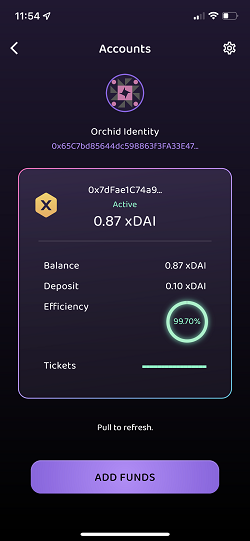

# Using the Orchid app

Welcome to the Orchid user guide. For product support, send an email to [help@orchid.com](mailto:help@orchid.com).


## Quick Setup

To get a single hop connection running ASAP, simply open the Orchid app, tap "Get started for $1", and confirm the $1 USD (or equivalent local currency) in-app purchase. Orchid will then fund your account on the xDAI blockchain with a 0.10 xDAI deposit and ~0.87 xDAI balance. The app will also construct a single hop circuit using the new account.

After the purchase completes, hit the “Connect” button to start the VPN, and you will connect randomly to an Orchid provider. The provider is selected based on the amount of OXT that provider staked on the network; this is for security purposes and incentive alignment.

It's that easy!


## Home

The home screen displays key pieces of information about how your device is connecting to the Internet, your account balance(s), an estimate on how many GB of service you could use, and the current average price of bandwidth. Tapping “Manage Accounts” will take you to the account manager. Tapping “1 Hop Circuit” will take you to the circuit builder. The average price per GB for VPN service is displayed by polling the Chainlink oracle, which averages the cost of bandwidth across the different providers in the network.

Problems with your account balance, deposit or circuit will be denoted with a red ‘!’.


### Circuit and account display

The active circuit and associated Orchid accounts that are paying for each hop are displayed in the middle of the home screen; this window will show the Orchid identity and balance of the active account. To change your active circuit, tap the “1 Hop Circuit” display to go into the circuit builder.

### Orchid identity

The hexadecimal address displayed for each hop in the circuit display is the Orchid identity associated with that account. **NOTE:** An Orchid identity is NOT an Ethereum wallet, even though it appears like an Ethereum wallet. Never send cryptocurrency to your Orchid identity; doing so could cause loss of funds.

An Orchid identity is your public address within the nanopayment system. When you first start the app, a new identity is created for you. You can easily create/delete/import/export identities in the account manager. You can add funds to an identity in the account manager on the xDAI chain using an in-app purchase or you can take the Orchid identity and add funds to it in the dApp.

### Connecting

For the “Connect” button to become available, you will need a funded account and an active circuit. If the circuit widget displays "0 Hop Circuit", tap on it, go into the circuit builder, and select from a funded Orchid account, an OpenVPN configuration or a WireGuard configuration to establish your circuit. After tapping “Connect”, Orchid will:

* Display "Orchid connecting”
* Pause all Internet traffic on the device
* Call the default Ethereum RPC to access the stake-weighted random selection smart contract
* Check to ensure that provider is in the [curator](https://docs.orchid.com/en/latest/using-orchid/#default-curator)
* Connect to the provider
* Change the status to “Connected” and animate the logo

Note that this process can sometimes take a few dozen seconds, depending on the status of Orchid’s providers. If the process is stuck, it could be because the Orchid providers are rejecting your Orchid account or because your device is having trouble connecting to the default Ethereum RPC endpoint, and so cannot get information about the state of the provider directory.

It is also possible to connect to a server, have the screen change states, and then have the connection die. Typically turning the app off/on can help kickstart the reconnect process whenever you experience no connectivity.

## **Account manager**

The account manager allows you to manage multiple accounts and associated identities. It is also where you can go to export and import accounts. The identity is displayed under "Orchid Identity". The funder wallet address is displayed inside the account. The identity and funder wallet together are key bits of information for each account. Learn more about Orchid's layer 2 nanopayment system: [Orchid accounts](https://docs.orchid.com/en/latest/accounts/).



### Add funds with an in-app purchase

Orchid includes a system for buying "prepaid access credits" to connect to our list of [preferred providers](https://www.orchid.com/preferredproviders). Orchid VPN providers that are not part of the preferred provider system cannot accept payments in prepaid access credits, which limits the number of providers available to you when using prepaid access credits. Also Orchid manages the funder wallet for the account. Therefore, the crypto purchased via in-app payments is custodial, and not available for withdrawal or transfer by the user.

The add funds option is available on iOS/macOS and Android. You will need a valid form of payment attached to your Apple or Google account associated with the phone to make the in-app purchase. The fiat amount of the in-app payment will be denominated in your local currency. The purchase will convert the amount to xDAI and fund the selected identity on the xDai blockchain, a stable payments blockchain designed for fast and inexpensive transactions. Orchid accounts created on xDAI are viewable using the [BlockScout Explorer](https://blockscout.com/xdai/mainnet/address/0x6dB8381b2B41b74E17F5D4eB82E8d5b04ddA0a82). Learn more about [xDai](https://www.xdaichain.com/).

When using the "Get Started for $1" quick start, you will fund the account for $1. From the account manager, you can add funds in three different preset amounts: $1, $5 and $20. This function is more appropriate for topping up an account when funds run low. Note that there is no significant advantage in terms of pricing for purchasing a larger account;~~.~~ Orchid is simply converting your fiat to the xDAI stablecoin and placing those funds on-chain in your selected account.

The average price per GB across the network is denoted on the homescreen and varies from provider to provider.

### Add funds with the dApp

To fund an account yourself you will need a wallet (we primarily test with [Metamask's Chrome plug-in](https://metamask.io/)) and the appropriate funds for the blockchain that you want to house the account. You will also need enough crypto to pay for the gas fees associated with executing the nanopayment contract.

Note: Do not transfer funds to your Orchid identity! That will not work. You will need to use the Orchid dApp in order to manage your on-chain funds yourself. All transactions using the dApp, including funding the account, unlocking your deposit, and withdrawing funds from the account, will require the user to pay for network fees on the blockchain that houses the account.

Before you can use the Orchid dApp, you will also need an Orchid identity that you intend to fund. From the account manager, you can tap on the hexadecimal string under Orchid Identity to copy the identity to your clipboard. Paste this information into the Identity field in the [dApp](https://account.orchid.com/) to manage that account.

Learn more about how to [create an account](https://docs.orchid.com/en/latest/orchid-dapp/#create-account) in the Orchid dApp.

### Sharing accounts

In previous iterations of Orchid, it was possible to share accounts by simply importing an identity, then the blockchain was automatically scanned to find the funder address associated with that identity.. As a result of opening our platform to partnerships with multiple chains – many that do not support scanning for Orchid accounts – users are required to specify the funder wallet and chain used to fund the account.

To share an account, you need to determine the L1 funder wallet address, import an L2 Orchid identity key, and select the chain the account was funded on.

### Importing accounts

To import an account, go to Manage Accounts, tap on the cog in the top-right, and select “Import Account”. From there, you can either select the identity you want to import from the dropdown menu, or select “Import Identity” to scan a new identity. Once you import the identity, you will enter the L1 funder address in the next menu, and then select the chain the account was funded on. Then you press “Import Account”, and your Orchid account will be available to use in the app.

### Exporting identities

To export your selected Orchid identity, go to “Manage Accounts”, tap on the cog wheel in the upper right, and select “Export Identity” to bring up the identity export interface. You will then get a scannable QR code of the key and a Copy button that will copy the key into your clipboard.

With the key, the funds in the Orchid account can be spent or extracted. It is a good practice to save the key in your password manager or to store it somewhere safe. The best practice for storing all the relevant details of an Orchid account is to save the funding wallet as a username and the raw key as the password in a password manager.

## Circuit builder

Orchid provides the only multi-hop VPN application that allows you to make an "onion route" through multiple independent VPN servers with layered encryption between each node. This screen allows you to manage the VPN server connections that form your circuit.

A single hop circuit is similar to a typical VPN provider. Three hops is a standard "onion route". For more information about the implications of multiple hops, refer to the [FAQ section on Security](https://docs.orchid.com/en/latest/faq/#security-and-privacy).

To add a hop to your circuit, enter the Circuit Builder menu by either selecting “Circuit Builder” in the menu or tapping on the “0 Hop Circuit” button on the main page. Here, you can view your current hop configuration and add hops. Swiping left or right on a hop will delete it, and long pressing on a hop will allow you to change its position in the circuit; the entry node is at the top of the screen and the exit node is at the bottom. While Orchid accounts are stored in the account manager, there is no way to store OpenVPN or WireGuard hops, except by adding them to your active circuit. See below on how to save your circuit and export the entire configuration, which could help you manage inactive OpenVPN or WireGuard hops.


### Orchid hop

Orchid hops are not a single specific server, but are rather defined as an Orchid account that will pay for a randomized node picked from the stake-weighted random directory. When you connect, the app runs through the directory and gets back a server to use in the circuit; this randomness is an important part of Orchid. For detailed information on stake-weighted random selection and why it matters, read section 4.4 of the [Orchid whitepaper](https://www.orchid.com/whitepaper/english.pdf).

To add an Orchid node, you will need to first select the identity of the payment account,then select the funding wallet. The Orchid identity and funding wallet are two key pieces of information that define an Orchid account.

The app scans blockchains using RPC servers for active accounts. If account detection fails, it is possible to paste in the funding wallet. Many of the multiple blockchains where you can house Orchid accounts do not support chain scanning, so you will need to manually paste in the funder wallet address. 

### WireGuard

Orchid supports WireGuard. When you add a WireGuard server to your circuit, Orchid will connect to that specific WireGuard server. Go to the Circuit Builder, tap “Add a Hop”, paste in your WireGuard configuration file, and hit save.

### OpenVPN

Orchid supports OpenVPN. Go to the Circuit Builder, tap “Add a Hop”, and then put in the information for that OpenVPN server.

OpenVPN configuration files can vary from VPN provider to VPN provider. We don't know if all configurations work; please email us at [help@orchid.com](mailto:help@orchid.com) for support, or to let us know what is working/not working for you. We appreciate your help!

Here are some items to note and check:

* Orchid uses OpenVPN3 without command line flags
* user/password is provided when adding the config. If your config contains `auth-user-pass` then try adding `client-cert-not-required` on a newline
* try removing arguments to `auth-user-pass`

### Saving your circuit

For Orchid hops, the app stores Orchid account information from the account manager. Deleting an Orchid hop doesn't destroy any information.

For WireGuard and OpenVPN, there is no way to save each specific hop at this time. If you delete either type of hop, the config information that you entered will be deleted.

One mechanism to save this information is to export your entire circuit configuration. Go to Settings, select “Configuration Management”, and tap the Export button. You can save this configuration as text, or generate a QR code to import your configuration to another client with the Import button.

## **Traffic analyzer**

Orchid has a built-in traffic monitor that can run with or without an Orchid account (it's a free feature!). Using the traffic monitor is similar to WireShark--and Orchid works on iOS! The traffic monitor also works across every platform that Orchid supports: iOS, macOS and Android.

To enable the traffic analyzer and review your device’s connections, tap on the traffic light icon in the upper right of the homescreen, or select “Traffic Analysis” from the menu.


### Traffic filters

The traffic analyzer supports different ways to filter the traffic to better make sense of the connections your phone is making:

* Enter a hostname or partial hostname into the search bar to show only matching rows.
* Enter multiple terms separated by a space to combine hostname filters using “AND” logic, e.g. “goog api” will match rows including both “goog” and “api”, such as “api1.google.com”.
* Use a “-” minus sign to exclude terms, e.g. “-goog” will show all hostnames _except_ those matching “goog”. You can mix these to include and exclude combinations such as: “google -api” to find all “google” entries excluding those with “api”.
* Use “prot:” to filter by protocol name, e.g. “prot:imap” will match all traffic identified as “imap” connections and “-prot:dns” will filter out all DNS queries from the results.

## Settings

From the homescreen, swipe right or tap the menu button in the top left. From there, you can navigate to all the screens in the app, get in-app help, and read the privacy policy, open source license and version number on the bottom.


### Default curator

Orchid uses an on-chain curated list which filters the viable nodes to a custom subset called a curator. Orchid's official curator is `partners.orch1d.eth`. The Orchid client uses this list to prevent certain kinds of attacks from malicious exit nodes (e.g. SSL downgrade attacks) by using a default list with trusted VPN partners.

The curator is set for each Orchid hop. This setting is the default that will appear whenyou add a hop. By leaving this blank, you will remove curation and accept a connection to any provider you connect to within the directory.

The curation system is open, and it is possible for anyone to make a curated list.

### Query balances

Orchid uses access to RPC endpoints to get information about account balances. If you do not want Orchid to connect to RPC endpoints for security reasons, turn off query balances in the Settings menu

### Advanced configuration

The advanced configuration box is where you can input custom commands into the client. Mainly this is used for testing purposes; however, there are some user facing commands that are useful.

### Chain Settings

The Chain Settings tab is where you can review connections to our partnered chains’ RPC endpoints.

The Ethereum Endpoint is the first and most important. For Orchid to connect, the app needs to access the Ethereum blockchain to access the stake weighted directory in order to find a provider. The default RPC uses [Alchemy](https://www.alchemy.com/). If you hit the TEST button and it fails, you will need to find a working RPC endpoint to get a VPN connection. You can override the default Ethereum RPC by pasting the endpoint into the provided box. Some options to consider if Alchemy is failing:

* Cloudflare runs a public endpoint. Simply paste in https://cloudflare-eth.com and hit test to see if that works.
* You can run your own Ethereum node using [GETH](https://geth.ethereum.org/)
* [Infura](https://infura.io/) offers free Ethereum endpoints after you register for an account
* [POKT Network](https://www.pokt.network/) offers a free Ethereum endpoint after you register for an account

Note that both POKT and Infura will require an account; after you register, they will provide a unique URL that you can paste in.

Other Endpoints:

If you have an account on a particular blockchain, the RPC server must be available in order for the app to be able to read your balance. Find the chain where your account is located and then test the chain to make sure the RPC endpoint is working. If not, find a new RPC endpoint for that chain and paste it into the box.

### Configuration management

The Configuration Management screen is a way to export and import all of the accounts currently on the app along with the current active circuit. This is very useful for backing up all your accounts and current application state.

Note: the keys to your Orchid account(s) will be exposed when you export your configuration. Use caution when exporting and do not store your keys in plaintext.

**Active circuit**: the active circuit contains all the information sent to the backend vpn tunnel to form the multi-hop route. For OpenVPN and WireGuard hops, the account information and details to connect to that VPN node is encoded. For each Orchid hop, there is a curator, the public address of the funding wallet, the Orchid account private key, chainid of where the account is housed, the currency and the RPC endpoint for accessing information on the blockchain where

```
hops = [{protocol: "orch1d", curator: "partners.orch1d.eth", funder: "<public address of funder wallet>", secret: "<Orchid account key>", chainid: 100, currency: "DAI", rpc="https://rpc.xdaichain.com/"}];
```

To clarify the key terms and definitions:

* **protocol**: the VPN tunnel protocol. Either "orch1d" for Orchid, "openvpn" for OpenVPN or "wireguard" for WireGuard
* **curator**: for Orchid hops, this is the curator for this hop 
* **funder**: the public address of the Ethereum wallet that created the account using the dApp; for xDAI accounts associated with the pre-paid access credit system, this address will be the custody wallet run by Orchid 
* **secret**: the key of the Orchid account; accessible by going to Account Manager, tapping on the cog in the top-right, and selecting “Export Identity” 
* **chainid**: the chainid of where the account is stored 
* **currency**: the currency of the account balance and deposit 
* **rpc**: the RPC endpoint used to look up account information on that chain

## Windows Beta

_Note: this is an early beta release that requires some effort on the command line in addition to manually editing files and installing a driver. Thank you for trying out our beta! Our product team would love to hear your feedback or help needed on our [Discord Channel](https://discord.gg/4ed63G7my5)_

### Download the Orchid client for Windows on Github

* Go to the [Orchid releases page](https://github.com/OrchidTechnologies/orchid/releases)
* Download the most recent `orchidcd-win_.0.x.x.exe` file and ensure it is at least version **0.9.35 or greater \
orchidcd**-win_.0.x.x.exe is the client, the other **orchidd**-win_.0.x.x.exe executable is the server

### Install the OpenVPN Tap driver

* Download the Tap driver here: [https://build.openvpn.net/downloads/releases/tap-windows-9.24.2-I601-Win10.exe](https://build.openvpn.net/downloads/releases/tap-windows-9.24.2-I601-Win10.exe)
* Run the exe file and follow the prompts to install the Tap driver
* Restart the machine

### Prepare your configuration file

* Read the above section on Configuration Management. You will need to export or create a complete configuration file that includes the details of all your hops. This can be done simply by going to Settings, tapping on “Configuration Management”, selecting “Export Hops Configuration” and then copying the line starting at "hops =". For xDAI accounts, some modifications are necessary.
* Paste your circuit from the configuration manager into a text editor. Note the chain used to fund the account..
* Enter a newline and add in the Ethereum RPC with `rpc = "https://cloudflare-eth.com/";`
* The final format should look like this for OXT accounts on Ethereum: **Note: funder starts with 0x and secret does not**

```
hops = [{curator: "partners.orch1d.eth", protocol: "orchid", funder: "0x000000000000000000000000000000000000000", secret: "00000000000000000000000000000000000000000000000000000000000000000"}];
rpc = "https://cloudflare-eth.com/";

```

* To use accounts on other blockchains, there is an extra step. You will need to add an RPC endpoint for that blockchain for each hop. For example, for a common XDAI account, you would add `, rpc="https://rpc.xdaichain.com/` after the currency variable **for each hop denoted in {}**. The final format should look like this:

```
hops = [{protocol: "orch1d", curator: "partners.orch1d.eth", funder: "0x000000000000000000000000000000000000000", secret: "00000000000000000000000000000000000000000000000000000000000000000", chainid: 100, currency: "DAI", rpc="https://rpc.xdaichain.com/"}];
rpc = "https://cloudflare-eth.com/";

```

* Save the file as `'orchid.cfg'`
    * In Notepad, you will need to make sure `.txt` is not appended. To do that, when you hit Save, select the “Save as type” dialog box and select “All Files.” This will allow you to save the file with the `.cfg` file extension.
    * Save as `'orchid.cfg'` and make sure it is in the same folder as the .exe file\

### Run the Orchid client

* Open the command prompt as Administrator
    * Click the Start/Windows icon button
    * Type `CMD`
    * Right click the Command Prompt icon and select `"Run as administrator"`
* At the command line prompt, navigate to the folder where you downloaded the .exe and saved the .cfg file
    * An easy way to do this is to copy the file path from the File Explorer top bar and then typing the command `"dir &lt;pasted in filepath>"`
* To run orchid, type `'orchidcd-win.exe --config orchid.cfg'`
* To stop, terminate the program using CTRL+C

## Gathering Logs

When debugging client-side issues, you might be requested to share logs. These logs provide advanced details about what the Orchid client is doing behind the scenes to provide you with a private browsing experience. This page is designed to help you collect and share the logs.

### Android Prerequisites

Start by turning on developer and debugging mode on the phone by going to `Settings -> About Phone -> About Software` and tapping on the build number repeatedly until it prompts you to enable developer mode. Then go to `Settings -> Developer Settings -> Turn on USB Debugging`.

### Android and iOS Prerequisites

When you connect your device to your computer, it will prompt you to trust the computer. It is important that you do so. Otherwise, you will be unable to collect logs.

### Cydia Impactor

The easiest way to gather logs from both iOS and Android devices is through [Cydia Impactor](http://www.cydiaimpactor.com/). In the main window, use the "Select" menu to choose the correct device (if you only have one mobile device connected to your computer, this will be done for you). Next, go to `Device -> Watch Log...`. A terminal window will appear, showing a streaming syslog from your mobile device.

### adb logcat (Android)

If you are using an Android device, you can alternatively collect logs through the Android Debug Bridge (ADB). You can follow this [guide](https://www.xda-developers.com/install-adb-windows-macos-linux/) to install adb on Windows, macOS, or Linux; once installed, you can run the following command in a terminal to view the logs:

```
adb logcat
```

### Sanitizing the Logs

The logs you gather will contain information from all applications and actions taken on your device during the period that logs are being gathered. These are not all necessary for debugging purposes. You can optionally filter out all lines that do not contain the string `orchid` as a quick way to sanitize the output. You can do this with a command like:

```
grep -i 'orchid' client.log
```

Where `client.log` is the file containing the syslog output from the device. You should also be careful to filter out your various secret keys from the logs:

```
grep -vi 'secret' client.log
```

### Sharing the Logs

The logs you gather will be quite long; you almost certainly do not want to paste them in their entirety into something like a Telegram message. Instead, we encourage you to either share them as an attachment via your preferred method of communication. If you are using a communication platform that doesn't support attachments, you can utilize a private pastebin service such as [GitHub Gists](https://gist.github.com/), which will provide you with a secret URL you can share to grant access to your logs.

## Orchid App troubleshooting/FAQs

### Help, my Internet connection shut off after I turned Orchid on

Orchid has a built-in “kill switch”, so turning Orchid on will sever all existing connections to the Internet and force them to go through Orchid. If Orchid is trying to connect, the Internet will be shut off until a connection is established. This is a feature that ensures that none of your Internet traffic will accidentally leak due to a disconnect/reconnect without you pressing the button first, and when you hit “Connect”, your traffic is only going through Orchid.

Read [Connecting](https://docs.orchid.com/en/latest/using-orchid/#connecting) for more information on exactly what happens when you hit “Connect”.

### I can’t find my QR code after creating an account in the dApp

When the QR code or text of an account is truly lost, the account is lost as well. If the account was ever added to the Orchid app, the account should appear under the cog wheel next to your Orchid Address.

The funds are NOT LOST! To recover the funds from a lost account, you will need to [withdraw the funds](https://docs.orchid.com/en/latest/orchid-dapp/#withdraw-tab) from that Orchid account using the dApp and the funder wallet used to create the account.

### Low balance/deposit/efficiency warning

Under certain market conditions, users need to increase the size of their deposit. The market conditions are primarily driven by the price of the currency and the amount of network fees required for the provider to claim a ticket. The face value of the ticket needs to be large enough for it to be profitable to pay the network fees to grab it; for more information on determining proper ticket size, visit our section on [determining balance and deposit size](https://docs.orchid.com/en/latest/orchid-dapp/#determining-balancedeposit-size), and then follow [Orchid’s guide to managing your deposit/balance](https://docs.orchid.com/en/latest/accounts/#deposit-size-too-small).
