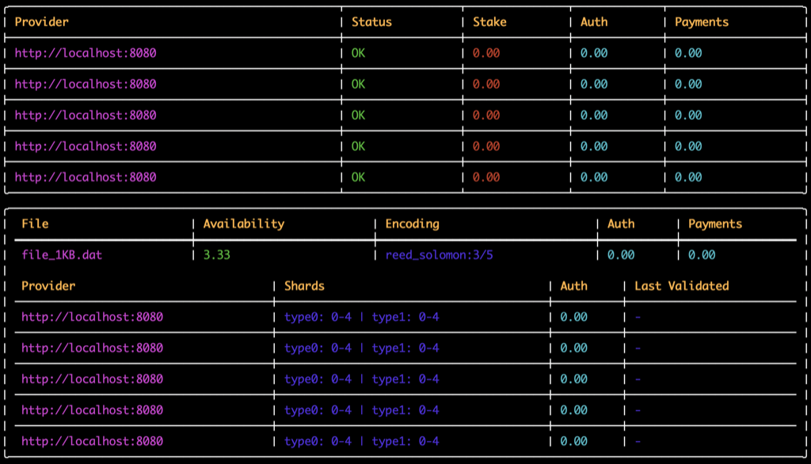

## Orchid Storage Project 

_*Orchid Storage is a **work in progress*** - Orchid is an open source project.  Help 
us build a truly decentralized storage system._

***TODO: Link to whitepaper***

This repository contains work in progress on the file encoding CLI and server framework.



A key aspect of the Orchid Storage project is the use of an efficient encoding scheme that minimizes
bandwidth costs incurred during migration of distributed data through providers over time.

**Twin Coding** is a hybrid encoding scheme that works with any two linear coding schemes and combines
them to achieve a space-bandwidth tradeoff, minimizing the amount of data that must be transferred
between storage nodes in order to recover a lost shard of data. In contrast to a traditional
erasure scheme, in which restoration of a lost node requires a full reconstruction of the original
file, Twin Coding allows for the recovery of a lost data shard with data transfer totalling exactly
the size of the lost data shard, with no additional transfer overhead.


This repository contains an implementation of Twin Coding, as well as a command line API for encoding 
files, decoding files with erasures, and optimally recovering lost shards. 

See [`twin_coding.py`](encoding/twin_coding.py) for an explanation of the algorithm, example code, and a link to the original paper.


## Installation

```
# Create a virtual environment
python3 -m venv venv
```

```
# Activate the virtual environment
# For macOS and Linux:
source venv/bin/activate
# For Windows:
.\venv\Scripts\activate
```

```
# Install the dependencies
pip install -r requirements.txt
```

## Example Usage
```
INSERT_USAGE
```

## Encoding CLI Examples

See also [`examples.sh`](examples/examples.sh)

```
INSERT_EXAMPLES
```

## CLI Docs

INSERT_STORAGE_DOCS

## Server Docs
```
INSERT_SERVER_DOCS
```

## Monitor Docs
```
INSERT_MONITOR_DOCS
```
