## Orchid Storage Project 

_*Orchid Storage is a **work in progress***_

Orchid is an open source project.  Help us in the effort to build a truly decentralized, incentive-aligned
storage system.  
Check out the [Orchid Storage Litepaper](https://www.orchid.com/storage-litepaper-latest.pdf)
and join the discussion on the [Orchid Subreddit](https://www.reddit.com/r/orchid).

This repository contains work in progress on the file encoding CLI and server framework.


## Overview

Orchid Storage is a (truly) decentralized storage system capable of maintaining files and issuing payments based on data availbility even when the client is offline.  This is accomplished through incentive aligned providers, non-interactive verification protocols, and efficient rebuilding and migration capabilities.

In this demo implementation files are imported to a local repository directory structure where they are optionally encrypted using an RSA key with AES and then encoded to a specified number of shards.  Shards are linear coded in a "k of n" scheme such that only a specified subset of shards must be recovered to reconstruct the file.  The use of Twin Coding (see below) allows individual shards to be reconstructed with minimal bandwidth by cooperating providers.

KZG Polynomial Commitments are generated for each shard. These commitments can later be used by either an interactive verifier or an on-chain contract without access to the original data to verify data availability. 



Shards are distributed to one or more providers as desired. Individual providers may host full complements of shards or they may be split for maximum distribution.


Periodic challenges are issued to providers, either interactively or via a source of on-chain randomness, requiring proof of specific data components.  Providers collect payments by proving data availability.  These payments can be optimized to require zero on-chain transactions when the client is available online but can still function via a non-interactive contract mechanism in the absence of the client.




## Twin Coding

A key aspect of the Orchid Storage project is the use of an efficient encoding scheme that minimizes
bandwidth costs incurred during migration of distributed data through providers over time.

Twin Coding is a hybrid encoding scheme that works with any two linear coding schemes and combines
them to achieve a space-bandwidth tradeoff, minimizing the amount of data that must be transferred
between storage nodes in order to recover a lost shard of data. In contrast to a traditional
erasure scheme, in which restoration of a lost node requires a full reconstruction of the original
file, Twin Coding allows for the recovery of a lost data shard with data transfer totalling exactly
the size of the lost data shard, with no additional transfer overhead.

This repository contains an implementation of Twin Coding, as well as a command line API for encoding 
files, decoding files with erasures, and optimally recovering lost shards. 

See [`twin_coding.py`](encoding/twin_coding.py) for an explanation of the algorithm, example code, and a link to the original paper.

And for more information check out the [Orchid Storage Litepaper](https://www.orchid.com/storage-litepaper-latest.pdf)

## Development Installation

```
# Create a virtual environment
python3 -m venv venv
```

```
# Activate the virtual environment
# For macOS and Linux:
source venv/bin/activate
# For Windows:
.\venv\Scripts\activate
```

```
# Install the dependencies
pip install -r requirements.txt
```

### Environment

The `STRHOME` (storage home) environment var is a path that determines the location of the default 
`repository` folder and `providers.jsonc` data stores.  During development you can source the provided 
`env.sh` script to automatically set `STRHOME` and `PYTHONPATH` to the project folder and activate the venv 
in that folder.

```
export STRHOME=[Project Folder]
export PATH=$PATH:"$STRHOME"
export PYTHONPATH="$STRHOME"
```


## Example Usage
```
INSERT_USAGE
```

## CLI Documentation
See [The CLI Documentation](cli_docs.md) for detailed CLI usage.


